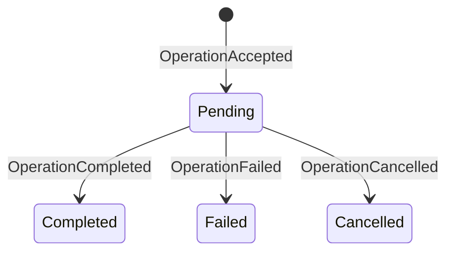

# Durability model

Nanocodex has one durability protocol. Rust owns it. Hosts store one opaque,
complete current-state value, and application layers project those facts for
their own APIs. Recovery loads one total state value.

The protocol protects the entire execution lifecycle: prompt admission, model
requests, warmup, compaction, tool effects, checkpoint commits, cancellation,
terminal results, and recovery. It is not a tool-only mechanism.

## Authority

| Layer | Durable responsibility | Never authoritative for |
|---|---|---|
| `nanocodex-durability` | Total state format, FIFO admission, effect recovery, checkpoints, terminals | Provider or application policy |
| State store | Atomic owner acquisition and compare-and-replace of one opaque value | State decoding or recovery decisions |
| Agent adapter | Stable IDs and typed inputs/outputs for model, compaction, warmup, and tool steps | Storage semantics |
| Managed Durable Object | Inbox, cancellation intent, retry deadline, terminal/event projection | Whether an inner effect may replay |

There is no second durable attempt state. A driver owns live operation claims
and running attempts in memory under its fenced owner capability. Losing the
driver loses those claims; it does not require a state mutation to release
them.

## Store contract

The live store protocol implements two operations:

1. `acquire(state_id, owner_id)` atomically advances the owner fence and
   returns the new token with one coherent state value.
2. `replace(state_id, owner_token, expected_revision, payload)` first checks
   the owner token, then the expected revision, and atomically replaces the old
   opaque Rust payload with the complete new value while advancing the revision.

There is exactly zero or one retained payload. Multiple historical batches are
corruption and are rejected. Receipt retention is a normal state transition,
not log-prefix compaction. Hosts never deserialize state.

This is a hard cutover. The envelope is `nanocodex_durable_state`; the former
`nanocodex_journal_state` envelope and individual event batches are rejected.
There is no adoption, migration, or compatibility reader for old durable data.

## Provider portability

The JavaScript memory, SQLite, Cloudflare Durable Object SQLite, and PostgreSQL
adapters also implement an offline transfer extension. `exportDurabilityState`
acquires a fresh owner fence at the source and returns one JSON-safe archive
containing the stable state ID, exact revision, and opaque total-state payload.
`importDurabilityState` installs that exact revision into an empty destination
and creates a fence before any destination agent can acquire it.

The state ID is part of the agent's durable identity and must not be rewritten.
The storage provider and physical database may change; the logical agent ID
does not. This lets the same Rust/WASM agent move, for example, from a
Cloudflare Worker Durable Object to Vercel with PostgreSQL and back again.
Completed operation IDs still replay their committed terminal results without
calling the model, while newly accepted operations continue from the imported
checkpoint. The first new model request after rehydration carries the committed
history and does not depend on a provider-owned previous-response handle.

This is a cutover protocol, not live replication or a distributed transaction:

1. stop accepting work and shut down the source agent;
2. export once, which fences any stale source writer;
3. transfer the archive as sensitive application data;
4. import into an empty destination under the archive's unchanged state ID;
5. start the destination agent and never resume the old source.

Importing the same archive into multiple destinations creates competing clones;
only one destination may become live.

Archives can contain conversation and tool state and are not encrypted by this
API. Applications own transport encryption, access control, retention, and
deletion. An ambiguous destination commit must be reconciled by loading the
destination; blindly resuming the source can create split-brain execution.

Store results have exact meanings:

| Result | Meaning | Same-owner retry |
|---|---|---|
| success | Mutation committed at the returned revision | Not needed |
| `NotCommitted` | Store guarantees no mutation occurred | Allowed |
| `Fenced` / `Conflict` | This owner or revision is stale | Forbidden |
| backend/transport error | Commit outcome is not proven | Forbidden; reacquire and reload |

## Total restart state

Every committed revision is independently decodable. It contains all retained
operations, each operation's full step states, the latest resumable checkpoint,
and whether a standalone checkpoint effect is currently in its uncertain
window. A stored revision never depends on an earlier revision.

## Operation state

The durable operation state machine is intentionally small:

Acceptance stores the exact operation ID and typed input. A duplicate with the
same input returns the existing state; the same ID with different input is an
error. Pending operations execute FIFO. Completion and failure atomically carry
the new resumable checkpoint. Cancellation may carry a safe interrupted
checkpoint.

Attempt starts, releases, and transient failures are live scheduling facts,
not durable facts.

## Effect state

Every operation-owned external effect uses a stable step ID and records its
normalized input before dispatch. This includes:

- model generation;
- WebSocket warmup;
- automatic compaction;
- tool execution.

Beginning a step returns exactly one value:

| Admission | Durable evidence | Caller action |
|---|---|---|
| `Execute` | No prior start, or an unfinished retry-safe start | Dispatch once and commit output |
| `Replay(output)` | An outcome is staged or materialized | Finish materialization if needed, then reuse the exact output; do not dispatch |
| `Unknown` | An unfinished at-most-once start exists | Do not dispatch; commit an explicit unknown result |

`Unknown` is data, not an operation-level exception. An interrupted unsafe tool
therefore becomes one structured failed tool result, is committed as that
step's output, and returns control to the model. The message says the effect
*may* have run because a committed start proves authorization, not handler
entry or external settlement.

Retry-safe model and compaction steps may execute again only with the same
stable identity and normalized input. Successful dispatch uses two settlement
transitions: `effect_pending -> outcome_ready -> completed`. If the second
commit is lost, recovery materializes the already-staged result without
repeating the effect. Completed results always replay.

Standalone compaction is a retry-safe checkpoint transform. It commits
`CheckpointEffectStarted` through the current owner immediately before provider
entry, then commits the resulting checkpoint. It cannot run while an accepted
operation is pending.

## Checkpoints and terminals

The checkpoint inside `OperationCompleted` or `OperationFailed` and that
operation's terminal result are one state replacement. A crash cannot expose a
new checkpoint without its terminal receipt or a terminal receipt without its
checkpoint.

Standalone developer-context and compaction boundaries use
`CheckpointCommitted`. They are rejected while an operation is pending, so a
standalone checkpoint cannot jump over FIFO work.

## Cancellation

Cancellation is durable intent at the application boundary and a terminal
state fact at the Rust boundary.

Managed cancellation may reserve an exact not-yet-admitted turn ID. Matching
admission consumes that reservation into `cancelling` before any model or tool
work starts. Active cancellation commits `OperationCancelled` before the API
reports completion. A definite `NotCommitted` may retry; any unknown store
outcome requires owner reacquisition and loading authoritative state.

## Managed projection

The Managed Durable Object has only these persisted turn states:

- `accepted`
- `cancelling`
- `completed`
- `cancelled`
- `failed`

Transient infrastructure failure does not create another state. The row stays
`accepted` or `cancelling` with `error`, `attempt_count`, and an absolute
`retry_at`. `turn_retryable` is a control event describing that schedule, not a
terminal or a separate source of truth.

The Durable Object commits the turn row and `turn_accepted` cursor before
returning HTTP 202. It commits a terminal row and terminal event cursor in the
same SQLite transaction. SSE live publication only wakes readers; replay from
the durable cursor is authoritative.

## Crash matrix

| Crash point | Recovered fact | Result |
|---|---|---|
| Before acceptance commit | No operation | Caller may submit normally |
| After acceptance, before effect start | Pending operation | New owner claims and executes |
| After retry-safe effect start | `effect_pending` retry-safe step | Execute again with the same identity and input |
| After unsafe effect start | Started at-most-once step | `Unknown`; never redispatch |
| After effect returns, before staged settlement | `effect_pending` | Apply the configured safe/unsafe recovery rule |
| After outcome staging | `outcome_ready` | Materialize and replay exact output; never redispatch |
| After materialization | `completed` | Replay exact output |
| During terminal replacement with `NotCommitted` | Pending operation | Same valid owner may retry |
| During terminal replacement with unknown outcome | Unknown store result | Reacquire, reload, then decide |
| After terminal commit | Terminal operation | Replay terminal; no execution |
| After managed terminal transaction, before SSE send | Terminal row/event | Cursor replay delivers it |

## Invariants

1. Persist before dispatch.
2. Never infer a commit from a transport error.
3. Never retry on a stale owner.
4. Never automatically repeat an unfinished at-most-once effect.
5. Never represent uncertainty as a permanent thread-wide block.
6. Never split a checkpoint from its terminal receipt.
7. Never let managed projection override Rust effect recovery.
8. Keep live ownership out of persistent state.

These invariants are exercised against memory, SQLite, Postgres, WASM host
stores, and Cloudflare Durable Object integration. A backend-specific failure
must map into the same store result meanings; it must not invent recovery
policy.

## Relationship to Pi `dev`

The execution core deliberately follows Pi's harness boundaries: a total
replace-in-place restart state, separate acceptance and driving, fenced single
ownership, intent/effect/settlement, staged tool outcomes, durable cancellation,
and atomic terminal checkpoint/result publication.

This crate is not a clone of Pi's complete session database. Pi also defines
immutable conversation entries, mutable bound values/lists, an append-only
usage ledger, assistant-frame persistence, lanes/navigation, and operation
cleanup. Nanocodex keeps conversation data inside its typed agent checkpoint
and scopes this crate to execution recovery. Claiming those storage subsystems
were copied would be false; the shared durability invariants are the part
implemented here.
